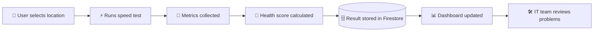
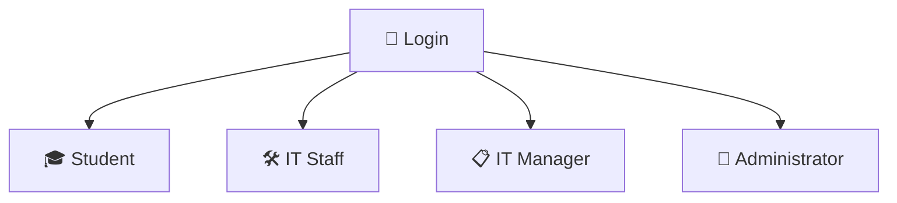
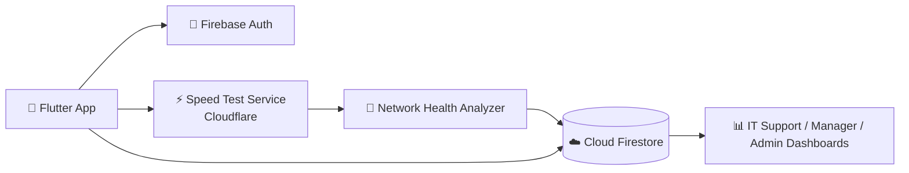

<div align="center">


<a href="https://git.io/typing-svg">
  
</a>

<br/>


</div>

---

## 🌐 The Problem

Every student knows the feeling: the Wi-Fi dies in the middle of a deadline. Problems are usually reported informally through messages, so the IT team doesn't have enough real data to know **where** and **when** the network is failing.

**Smart Campus Wi-Fi** puts everything in one platform: users run a network test, submit complaints, and the IT team gets a clear picture of network health across the whole campus.



---

## ✨ Features

| | Feature | Description |
|---|---|---|
| ⚡ | **Built-in Speed Test** | Measures download, upload, ping and packet loss using Cloudflare's speed endpoints |
| 💯 | **Network Health Score** | Converts raw metrics into a score out of 100 with a status: Excellent, Good, Fair, Poor or Critical |
| 📝 | **Complaint System** | Six problem categories, with the latest speed test attached as evidence |
| 🔄 | **Complaint Workflow** | Submitted → Reviewed → Assigned → In Progress → Resolved |
| ⚠️ | **Outage Detection** | A warning is raised automatically when several users report the same location |
| 🗺️ | **Campus Heatmap** | Green / Orange / Red view of every location's health |
| 📈 | **Analytics** | Performance by hour and day, most problematic locations, complaints by building, insights |
| 🆚 | **Location Comparison** | Compare two campus locations side by side |
| 📉 | **Trend Analysis** | Speed and latency trends over time with improving / declining detection |
| 🔁 | **Recurring Problems** | Finds issues reported repeatedly in the same place |
| 🛡️ | **Role-Based Access** | Student, IT Staff, IT Manager and Administrator, each with their own screen |
| 🔑 | **Permission Control** | The admin can grant or withdraw individual permissions for each role |
| ⚙️ | **Configurable Thresholds** | The admin sets the score limits for each health status and the outage trigger |
| 🤖 | **AI Chatbot** | Built-in assistant with saved chat history |
| 🌙 | **Dark Mode** | Theme switch in settings |

---

## 👥 Roles



| Role | Firestore value | What they can do |
|---|---|---|
| 🎓 **Student / Staff** | `student` | Select a location, run speed tests, view results, submit complaints, see outages and network health, view personal history |
| 🛠️ **IT Support Staff** | `it_staff` | View test results and complaints, assign and update complaint status, monitor outages |
| 📋 **Network / IT Manager** | `manager` | Manage campus locations, view overall health, compare two locations, analyse speed and latency trends, review recurring problems, monitor IT activity logs, view reports and analytics |
| 👑 **Administrator** | `admin` | See all registered users and assign or change roles, grant or withdraw permissions per role, view the system-wide report, configure network health thresholds |

---

## 💯 How the Health Score Works

Every test is turned into a score out of **100**:

| Metric | Weight | Full marks when |
|---|---|---|
| ⬇️ Download | 40 | 50 Mbps or more |
| ⬆️ Upload | 20 | 20 Mbps or more |
| ⏱️ Ping | 30 | 20 ms or less (0 points at 200 ms) |
| 📉 Packet loss | 10 | 0% (0 points at 10% or more) |

Default status levels (the admin can change these in the Admin Panel):

| Score | Status |
|---|---|
| 85 – 100 | 🟢 Excellent |
| 70 – 84 | 🟢 Good |
| 50 – 69 | 🟠 Fair |
| 30 – 49 | 🔴 Poor |
| 0 – 29 | 🔴 Critical |

An **outage warning** appears when a location has 3 or more unresolved complaints (also configurable).

---

## 🏗️ Architecture



**Firestore collections**

| Collection | Purpose |
|---|---|
| `users` | Name, email, role, created date |
| `speed_tests` | Location, download, upload, ping, packet loss, health score and status, timestamp |
| `complaints` | Location, type, description, status, attached speed test, assigned staff |
| `locations` | Campus locations with building and floor |
| `role_permissions` | Permissions granted to each role |
| `settings` | Health thresholds configured by the admin |
| `activity_logs` | IT staff actions |

---

## 📂 Project Structure

```
lib/
├── main.dart                    # App start, theme, Firebase setup
├── firebase_options.dart        # Firebase configuration
├── auth_controller.dart         # Sign up, login, logout, delete account
├── login_screen.dart            # Login
├── signup_screen.dart           # Create account with validation
├── home_screen.dart             # Role-based home
│
├── speed_test_service.dart      # Download / upload / ping / packet loss + score
├── speed_test_screen.dart       # Location select + run test + live status
├── network_health.dart          # Health colours, status, averages, outage logic, thresholds
├── permission_service.dart      # Role permissions
├── location_service.dart        # Campus location names
│
├── complaint_screen.dart        # Submit a complaint
├── manage_complaints_screen.dart# IT staff complaint handling
├── history_screen.dart          # Personal tests and complaints
├── network_health_screen.dart   # Student view of campus health
├── dashboard_screen.dart        # Stats, outages and locations
├── test_results_screen.dart     # All tests with filters
├── analytics_screen.dart        # Heatmap, hour/day analysis, insights
│
├── manager_screen.dart          # IT Manager dashboard
├── manage_locations_screen.dart # Add / delete campus locations
├── admin_screen.dart            # Users, permissions, system report, thresholds
├── manage_users_screen.dart     # Role assignment list
│
├── chatbot_screen.dart          # AI chatbot
├── account_screen.dart          # Profile and account
├── settings_screen.dart         # Dark mode
├── credits_screen.dart          # Team credits
├── exit_app_helper.dart         # Double-back-to-exit
└── fade_slide_in.dart           # Entrance animation
```

---

## 🚀 Getting Started

**Requirements:** Flutter SDK, an Android device or emulator, and a Firebase project.

```bash
# 1. Clone the repository
git clone https://github.com/your-username/smart-campus-wifi-monitor.git
cd smart-campus-wifi-monitor

# 2. Install packages
flutter pub get

# 3. Run the app
flutter run
```

**Firebase setup**

1. Create a Firebase project and add an Android app.
2. Enable **Authentication → Email/Password**.
3. Create a **Cloud Firestore** database.
4. Run `flutterfire configure` to generate `firebase_options.dart`.

**Make yourself the first admin**

New accounts start as `student`. After signing up, open Firestore → `users` → your document and change `role` to `admin`. From then on, use the **Admin Panel → Users** tab to assign roles to everyone else.

Valid roles: `student`, `it_staff`, `manager`, `admin` (lowercase).

---

## 🎬 Demo

> 📹 **Demo video:** _add your link here_
>
> 📱 **APK:** _add your link here_

---

## 🛠️ Built With

- **Flutter & Dart** for the mobile app
- **Firebase Authentication** for login and accounts
- **Cloud Firestore** for real-time data
- **GetX** for navigation and state
- **Cloudflare Speed endpoints** for the speed test
- **Hive** for saved chatbot history
- **Groq API** for the AI chatbot

---

## 🏆 Team Zero

<div align="center">

| 👤 | 👤 | 👤 | 👤 |
|:---:|:---:|:---:|:---:|
| **Umar** | **Haya** | **Shumail** | **Sabra** |

*Made with passion for the Problem-Solving Hackathon* ❤️

</div>

---

<div align="center">

⭐ If you like this project, give it a star!


</div>
